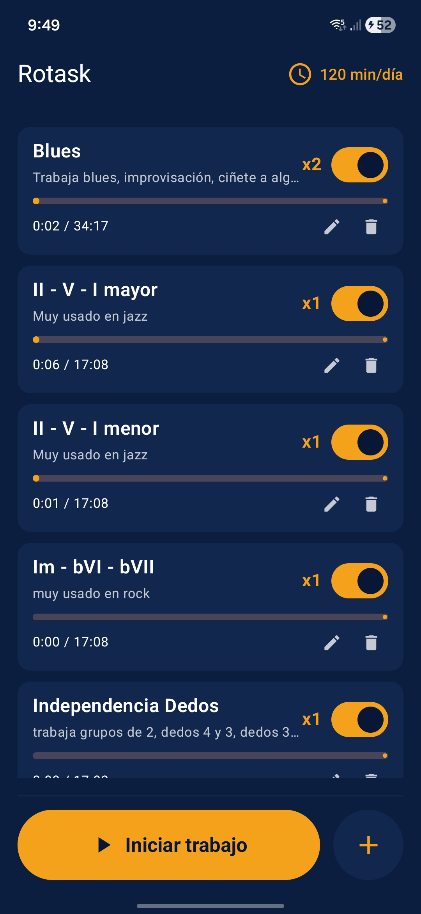
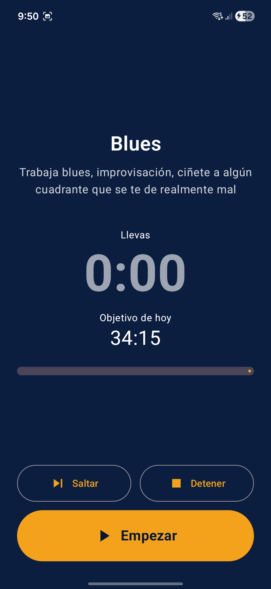

# Rotask

Android app to split your working time across several tasks with configurable weights, rotating toward the most behind one every time you press "Start work".

<p align="center">
  
  
</p>

## Idea

- You add tasks with a name, an optional description (what to train) and a weight (decimal).
- Each task can be **active** or **paused**. Paused tasks don't rotate but remain visible and keep their debt.
- You configure minutes per day.
- Each active task gets a daily target proportional to its weight, divided over the sum of active weights. Example: 4 active tasks with weights 2/1/1/1 and 60 min/day → 24/12/12/12 min.
- When you press **Start work** the app picks the active task with the most pending seconds today and opens a session paused. You press play when you're ready.
- When a session reaches its target (or you press Skip) the next-most-behind active task is loaded already paused, so you control when the next session starts.
- Each day is independent. If you don't reach today's target nothing carries over: tomorrow you start fresh with that day's target. Working over the target also doesn't bank credit.

## Stack

- Kotlin 2.0 + Jetpack Compose (Material 3)
- Room for local persistence
- Navigation Compose
- minSdk 26, targetSdk 35

## Project layout

```
app/src/main/java/com/rotask/
├── data/        Entities + DAOs + AppDatabase (Room) + Migrations
├── domain/      TaskScheduler (settle + pick) and RotaskRepository
└── ui/
    ├── home/    HomeScreen + HomeViewModel
    ├── work/    WorkScreen + WorkViewModel
    ├── theme/   Colors, typography, Theme
    └── format/  Formatting helpers (mm:ss, weights)
```

## Build

```bash
./gradlew assembleDebug
```

Recommended: open the project in Android Studio (Hedgehog+) and let it sync Gradle the first time.

## Localization

Default language is English (`res/values`). Spanish translation lives in `res/values-es`. The system picks the user's locale automatically.

## Algorithm (summary)

Each day stands on its own — no cross-day carryover. Today's target for an active task is just its proportional share of the daily budget:

```
for each active task t today:
  target_t   = dailyMinutes * 60 * weight_t / sum_active_weights
  worked_t   = seconds worked on t today (sum over today's work_sessions)
  remaining  = max(0, target_t - worked_t)
```

`pickNext()` returns the active task with the largest `remaining`. At midnight everyone resets to a fresh `target_t` with `worked_t = 0`.

## License

MIT. See [LICENSE](LICENSE).
